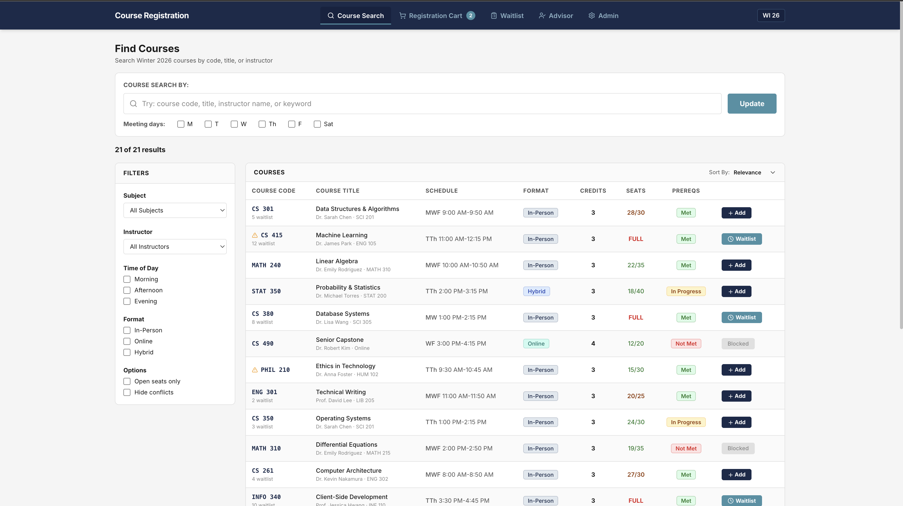

# GSU Modern University Course Registration System

**INFO 380: Product and Information Systems Management — Winter 2026**
Taught by Richard Sturman | Team BB-16

A front-end prototype for a modernized course registration system for Global State University (GSU), a large public research institution serving 45,000+ students. The current registration system, built in the early 2000s, struggles with modern needs like cross-disciplinary programs, hybrid courses, and real-time capacity management. This prototype demonstrates the proposed user experience across student, advisor, and admin workflows.



<p align="center">
  <a href="https://info380.joechamdani.com">
    
  </a>
</p>

## Team

- Joseph Chamdani
- Kenneth Wu
- Nicole Luu
- Evelyn Fu

## Problem Statement

GSU's legacy registration system causes significant pain points identified through stakeholder interviews:

- **Students** face slow performance during peak registration, an outdated mobile-unfriendly interface, opaque waitlist processes, and manual prerequisite checking across multiple windows
- **Advisors** lack real-time information and must navigate 4+ disconnected systems to view a single student's registration status, holds, and degree progress
- **Administrators** struggle with cumbersome capacity management, manual cross-listed course balancing, and limited reporting on registration patterns

## Prototype Features

This prototype demonstrates five core interfaces mapped to our product backlog epics and user stories:

### Student Views
- **Course Search** — Real-time search with filters (subject, instructor, day/time, format). Color-coded prerequisite indicators. Sortable by code, title, credits, open seats, or waitlist size. *(Epic 1, 6, 7)*
- **Registration Cart** — Shopping cart with visual weekly calendar. Schedule conflict detection (highlighted in red), credit limit validation (18 max), and backup section selection. Single-screen registration flow. *(Epic 1, 5)*
- **Waitlist Management** — Real-time position tracking ("X of Y" format), enrollment probability badges (High/Medium/Low), estimated wait times, auto-enroll toggles, and notification preferences (email/SMS). *(Epic 2, 9)*

### Staff Views
- **Advisor Dashboard** — Unified student lookup by name/ID. Tabbed interface showing current schedule, waitlists, degree progress, and override requests with one-click approve/deny. Eliminates the need to access 4 separate systems. *(Epic 3, 4, 6)*
- **Admin Dashboard** — Course capacity management, real-time enrollment analytics by department, report builder, audit log, and system performance metrics. *(Epic 4, 8)*

## Tech Stack

| Technology | Purpose |
|------------|---------|
| React 18 + TypeScript | UI framework |
| Vite | Build tool |
| Tailwind CSS v4 | Styling |
| Framer Motion | Animations |
| Lucide React | Icons |

## Getting Started

```bash
npm install
npm run dev
```

Other commands: `npm run build` (production build), `npm run preview` (preview build)

## Project Structure

```
src/
├── App.tsx                  # App shell, navigation, role-based context
├── index.css                # Tailwind config and global styles
├── main.tsx                 # Entry point
├── data/
│   ├── mockData.ts          # Sample courses, students, waitlists, analytics
│   └── types.ts             # TypeScript interfaces (Course, Student, etc.)
└── views/
    ├── CourseSearch.tsx      # WF1: Search, filter, sort, add to cart
    ├── RegistrationCart.tsx  # WF2: Cart + weekly calendar + submit
    ├── WaitlistManagement.tsx # WF3: Position tracking + notifications
    ├── AdvisorDashboard.tsx  # WF4: Student lookup + overrides
    └── AdminDashboard.tsx   # WF5: Capacity + analytics + audit log
```

## System Context

In a full production implementation, this registration system would integrate with GSU's existing enterprise systems:

- **Student Information System (SIS)** — Oracle PeopleSoft for academic records
- **Learning Management System (LMS)** — Canvas for course content
- **Financial Aid Management System (FAMS)** — Aid eligibility and disbursement
- **Identity Management System (IMS)** — Microsoft AD for SSO authentication
- **Degree Audit System (DAS)** — Prerequisite and graduation requirement tracking
- **Payment Processing System (PPS)** — TouchNet for financial transactions

## Project Artifacts

This prototype is one deliverable of a larger systems analysis project. Other artifacts produced by the team include:

- Product backlog with epics and user stories (Jira)
- Stakeholder interview analysis
- Workflow diagrams (Student Registration, Advisor Registration)
- Wireframes with annotated acceptance criteria (Figma)
- Data flow diagrams
- Non-functional requirements specification

## License

This project is licensed under the [MIT License](LICENSE).
